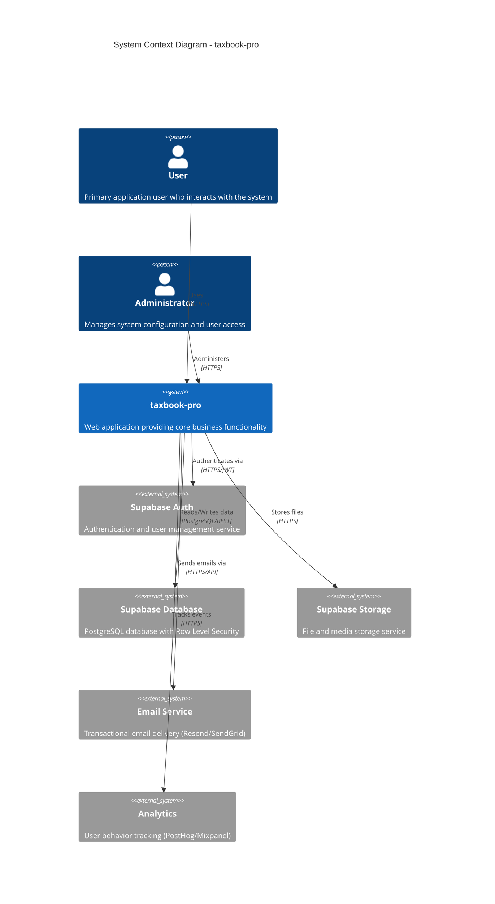
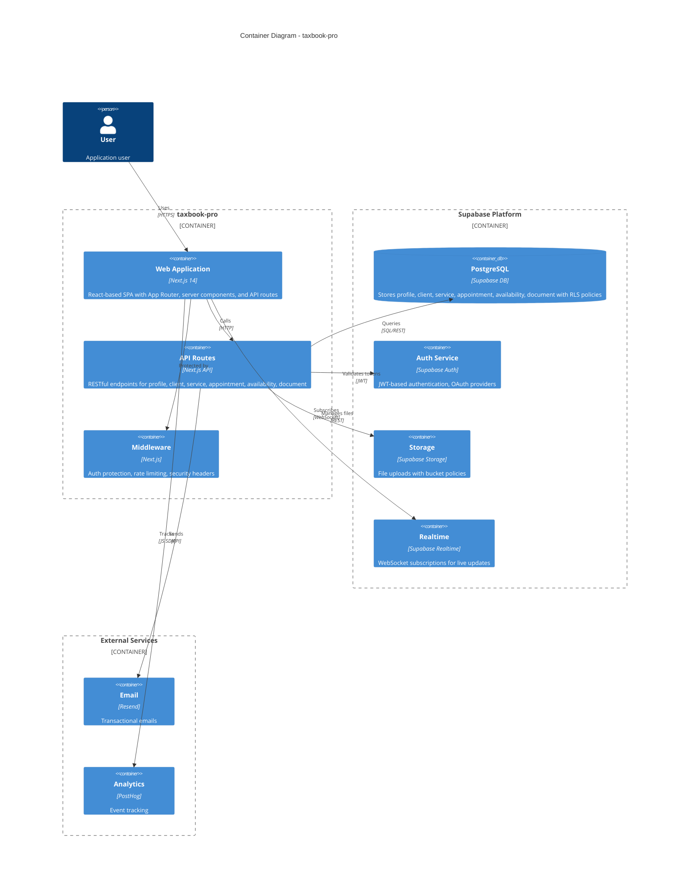
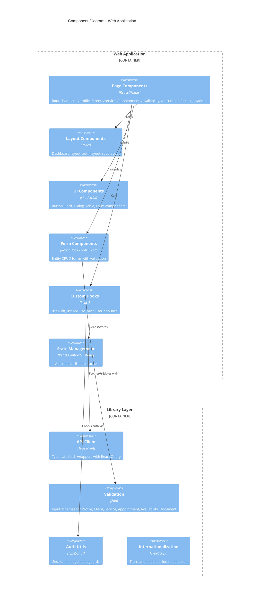
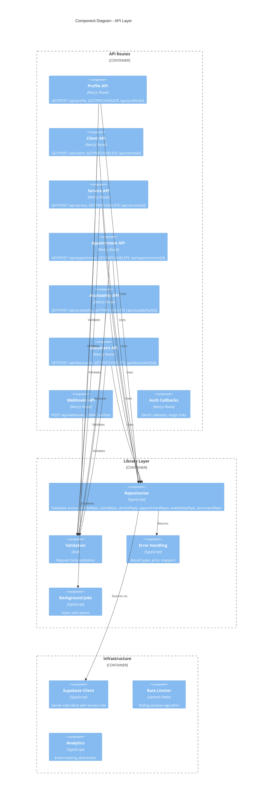
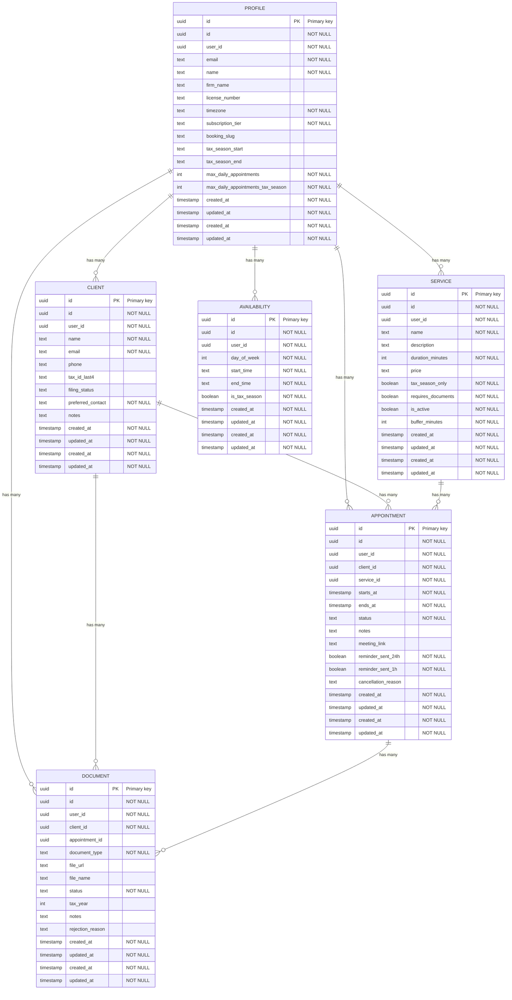
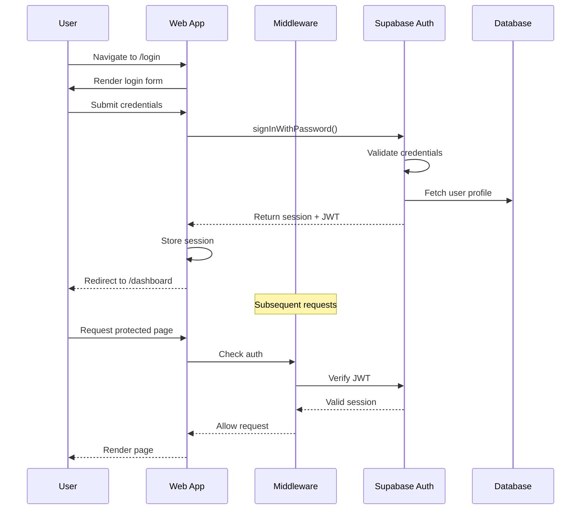
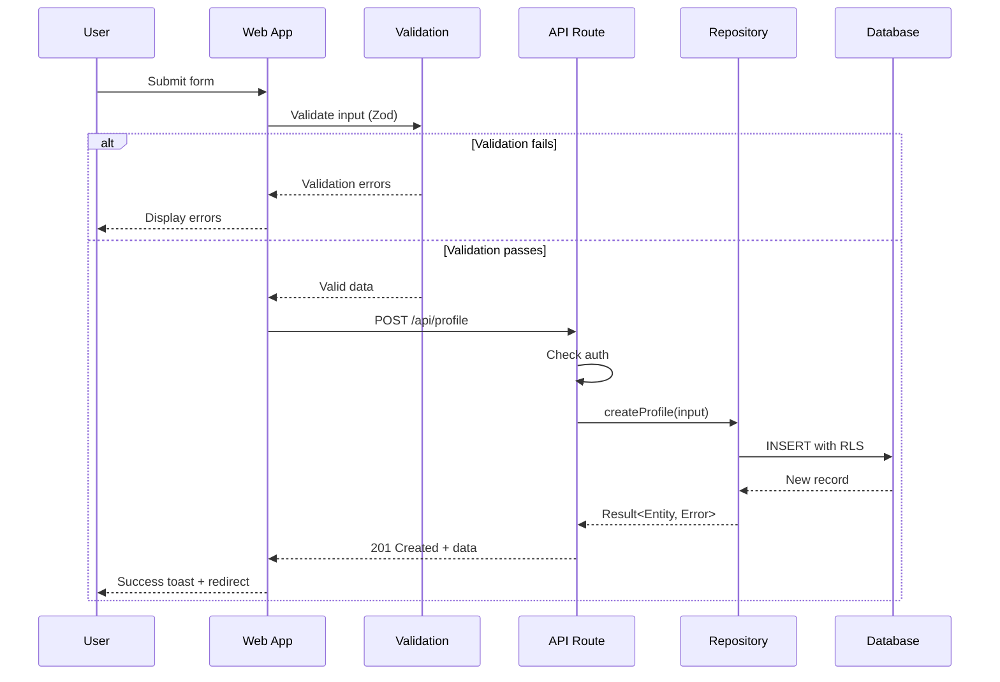
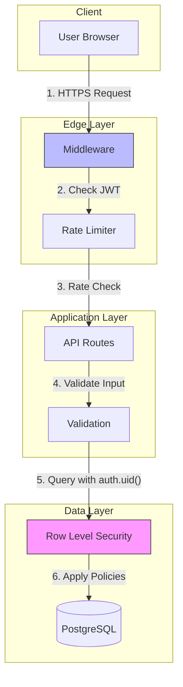
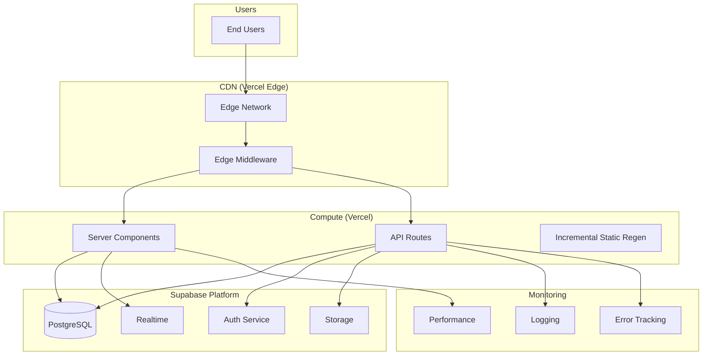

# Architecture Diagrams - taxbook-pro

Generated: 2026-01-19

---

## Overview

This document provides C4 model architecture diagrams for taxbook-pro using Mermaid syntax. The C4 model visualizes software architecture at four levels of abstraction: Context, Container, Component, and Code.

**Rendering:** These diagrams use Mermaid syntax. View them in:
- GitHub/GitLab (native support)
- VS Code with Mermaid extension
- [Mermaid Live Editor](https://mermaid.live)

---

## Level 1: System Context

The System Context diagram shows taxbook-pro and its relationships with users and external systems.



### Context Narrative

taxbook-pro is a web application that serves users and administrators. The system leverages Supabase for:

- **Authentication**: Secure user sign-up, login, and session management
- **Database**: PostgreSQL with Row Level Security for data isolation
- **Storage**: Secure file uploads with access control


---

## Level 2: Container Diagram

The Container diagram shows the high-level technical building blocks of taxbook-pro.



### Container Responsibilities

| Container | Technology | Responsibility |
|-----------|------------|----------------|
| Web Application | Next.js 14 + React | UI rendering, client-side state, server components |
| API Routes | Next.js API Routes | Business logic, validation, data access |
| Middleware | Next.js Middleware | Auth guards, rate limiting, headers |
| PostgreSQL | Supabase | Data persistence with RLS |
| Auth Service | Supabase Auth | User identity, sessions, OAuth |
| Storage | Supabase Storage | File management with policies |

---

## Level 3: Component Diagram

The Component diagram shows the internal structure of key containers.

### Web Application Components



### API Layer Components



### Component Inventory

| Layer | Component | Purpose |
|-------|-----------|---------|
| API | Profile Routes | CRUD operations for Profile |
| API | Client Routes | CRUD operations for Client |
| API | Service Routes | CRUD operations for Service |
| API | Appointment Routes | CRUD operations for Appointment |
| API | Availability Routes | CRUD operations for Availability |
| API | Document Routes | CRUD operations for Document |
| API | Webhooks | External event ingestion |
| Library | Repositories | Data access abstraction |
| Library | Validation | Input sanitization |
| Library | Error Handling | Consistent error responses |
| UI | Page Components | Route-based views |
| UI | Form Components | Data entry with validation |
| UI | UI Components | Reusable design system |

---

## Level 4: Code (Entity Relationships)

The Code level diagram shows the data model and entity relationships.

### Entity Relationship Diagram



### Domain Type Definitions

```typescript
// Branded ID types (prevent ID type confusion)
type ProfileId = Brand<string, "ProfileId">;
type ClientId = Brand<string, "ClientId">;
type ServiceId = Brand<string, "ServiceId">;
type AppointmentId = Brand<string, "AppointmentId">;
type AvailabilityId = Brand<string, "AvailabilityId">;
type DocumentId = Brand<string, "DocumentId">;

// Entity interfaces
interface Profile {
  readonly id: ProfileId;
  readonly id: string;
  readonly userId: string;
  readonly email: string;
  readonly name: string;
  readonly firmName: string;
  readonly licenseNumber: string;
  readonly timezone: string;
  readonly subscriptionTier: string;
  readonly bookingSlug: string;
  readonly taxSeasonStart: Date;
  readonly taxSeasonEnd: Date;
  readonly maxDailyAppointments: number;
  readonly maxDailyAppointmentsTaxSeason: number;
  readonly createdAt: Date;
  readonly updatedAt: Date;
  readonly createdAt: Date;
  readonly updatedAt: Date;
}

interface Client {
  readonly id: ClientId;
  readonly id: string;
  readonly userId: string;
  readonly name: string;
  readonly email: string;
  readonly phone: string;
  readonly taxIdLast4: string;
  readonly filingStatus: string;
  readonly preferredContact: string;
  readonly notes: string;
  readonly createdAt: Date;
  readonly updatedAt: Date;
  readonly createdAt: Date;
  readonly updatedAt: Date;
}

interface Service {
  readonly id: ServiceId;
  readonly id: string;
  readonly userId: string;
  readonly name: string;
  readonly description: string;
  readonly durationMinutes: number;
  readonly price: number;
  readonly taxSeasonOnly: boolean;
  readonly requiresDocuments: boolean;
  readonly isActive: boolean;
  readonly bufferMinutes: number;
  readonly createdAt: Date;
  readonly updatedAt: Date;
  readonly createdAt: Date;
  readonly updatedAt: Date;
}

interface Appointment {
  readonly id: AppointmentId;
  readonly id: string;
  readonly userId: string;
  readonly clientId: string;
  readonly serviceId: string;
  readonly startsAt: Date;
  readonly endsAt: Date;
  readonly status: string;
  readonly notes: string;
  readonly meetingLink: string;
  readonly reminderSent24h: boolean;
  readonly reminderSent1h: boolean;
  readonly cancellationReason: string;
  readonly createdAt: Date;
  readonly updatedAt: Date;
  readonly createdAt: Date;
  readonly updatedAt: Date;
}

interface Availability {
  readonly id: AvailabilityId;
  readonly id: string;
  readonly userId: string;
  readonly dayOfWeek: number;
  readonly startTime: string;
  readonly endTime: string;
  readonly isTaxSeason: boolean;
  readonly createdAt: Date;
  readonly updatedAt: Date;
  readonly createdAt: Date;
  readonly updatedAt: Date;
}

interface Document {
  readonly id: DocumentId;
  readonly id: string;
  readonly userId: string;
  readonly clientId: string;
  readonly appointmentId: string;
  readonly documentType: string;
  readonly fileUrl: string;
  readonly fileName: string;
  readonly status: string;
  readonly taxYear: number;
  readonly notes: string;
  readonly rejectionReason: string;
  readonly createdAt: Date;
  readonly updatedAt: Date;
  readonly createdAt: Date;
  readonly updatedAt: Date;
}

```

### Relationship Summary

| From | To | Type | Foreign Key | On Delete |
|------|----|----- |-------------|-----------|
| Client | Profile | many-to-one | user_id | CASCADE |
| Service | Profile | many-to-one | user_id | CASCADE |
| Appointment | Profile | many-to-one | user_id | CASCADE |
| Appointment | Client | many-to-one | client_id | CASCADE |
| Appointment | Service | many-to-one | service_id | CASCADE |
| Availability | Profile | many-to-one | user_id | CASCADE |
| Document | Profile | many-to-one | user_id | CASCADE |
| Document | Client | many-to-one | client_id | CASCADE |
| Document | Appointment | many-to-one | appointment_id | CASCADE |

---

## Data Flow Diagrams

### User Authentication Flow



### Entity CRUD Flow



---

## Key Architectural Decisions

### 1. Authentication Strategy

**Decision:** Supabase Auth with JWT tokens

**Rationale:**
- Built-in RLS integration for data isolation
- OAuth provider support (Google, GitHub, etc.)
- Session management handled by platform
- Secure token refresh mechanism

### 2. Data Access Pattern

**Decision:** Repository pattern with Result types

**Rationale:**
- Explicit error handling (no thrown exceptions)
- Type-safe database operations
- Testable data layer
- RLS policies at database level

### 3. API Design

**Decision:** RESTful routes with typed contracts

**Rationale:**
- Standard HTTP methods (GET, POST, PATCH, DELETE)
- Consistent response format (`{ success, data, error }`)
- OpenAPI documentation
- Type generation from database schema

### 4. State Management

**Decision:** Server components + React Query for client state

**Rationale:**
- Minimize client-side JavaScript
- Automatic cache invalidation
- Optimistic updates where appropriate
- SSR-first approach


---

## Integration Points

### External Service Integration

| Service | Purpose | Integration Method | Error Handling |
|---------|---------|-------------------|----------------|
| Supabase Auth | User authentication | SDK + JWT | Redirect to login |
| Supabase DB | Data persistence | SDK + REST | Result type errors |
| Supabase Storage | File uploads | SDK | Upload retry logic |
| Email (Resend) | Transactional email | REST API | Queue for retry |
| Analytics | Event tracking | JS SDK | Fire and forget |

### Webhook Endpoints

| Endpoint | Source | Verification | Handler |
|----------|--------|--------------|---------|
| `/api/webhooks` | External services | HMAC signature | Event router |
| `/api/auth/callback` | OAuth providers | State parameter | Session creation |

---

## Security Architecture

### Authentication Layers



### RLS Policy Strategy

All tables with user data enforce Row Level Security:

```sql
-- Example: Users can only access their own data
CREATE POLICY "Users can view own data"
    ON profile
    FOR SELECT
    USING (auth.uid() = user_id);

-- Team access uses SECURITY DEFINER functions to avoid recursion
CREATE FUNCTION is_team_member(team_id UUID, user_id UUID)
RETURNS BOOLEAN AS $$
    SELECT EXISTS (SELECT 1 FROM team_members WHERE ...);
$$ LANGUAGE SQL SECURITY DEFINER STABLE;
```

---

## Deployment Architecture



### Environment Configuration

| Environment | URL Pattern | Database | Purpose |
|-------------|-------------|----------|---------|
| Development | localhost:3000 | Local/Branch DB | Feature development |
| Preview | pr-*.vercel.app | Branch DB | PR review |
| Staging | staging.*.com | Staging DB | Pre-production testing |
| Production | *.com | Production DB | Live users |

---

## Appendix: Diagram Legend

### C4 Diagram Shapes

| Shape | Meaning |
|-------|---------|
| Person | Human user or actor |
| System | Software system (yours or external) |
| Container | Deployable unit (app, database, etc.) |
| Component | Module within a container |

### Relationship Lines

| Line Style | Meaning |
|------------|---------|
| Solid arrow | Direct dependency |
| Dashed arrow | Async/eventual |
| Double line | Bidirectional |

### Entity Relationship Cardinality

| Symbol | Meaning |
|--------|---------|
| `\|\|` | Exactly one |
| `o\|` | Zero or one |
| `\|{` | One or more |
| `o{` | Zero or more |

---

*Generated by Mental Models SDLC - Architecture-First Design*
